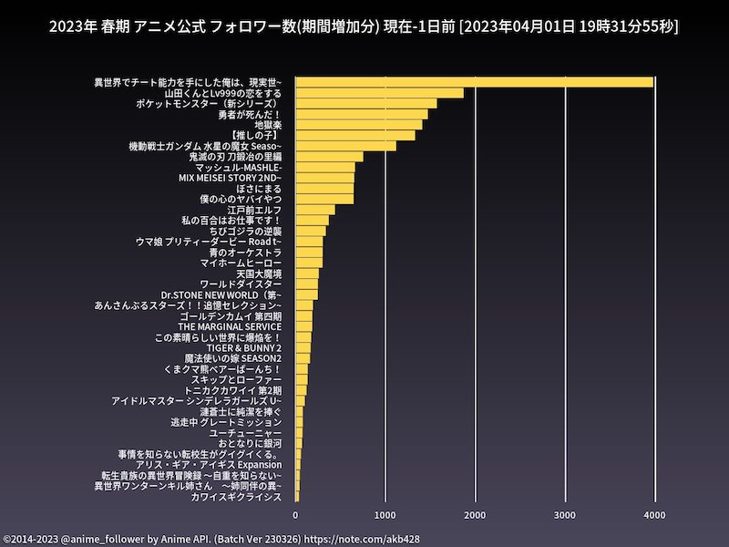

# Sana1

ShangriLa Anime APIサーバーから毎シーズンのアニメ作品情報を取得しその作品のTwitterアカウントのフォロワー数のランキングをグラフ化しツイートするバッチです。

TwitterAPI 1.1を使用していますので2023年4月で動かなくなります。グラフ生成や全体的なロジックの参考になればと思います。

## アーキテクチャ図


AWSでの実行例


## DB設定

MySQLに下記のDDLを実行してください

https://github.com/Project-ShangriLa/anime_master_db_ddl


## Twitter API Keyとimgur API Keyの設定

./config/conf.json.sampleを下記コマンドでコピーしてTwitterのAPIキーを設定してください

imgurに画像をアップロードしたい場合はimgurのAPIキーも設定してください

```
cp ./config/conf.json.sample ./config/conf.json
```

## AWS S3バケットを使う場合（オプション）
.env.sampleを下記コマンドでコピーしてAWSのAPIキーを設定してください

```
cp .env.sample .env
```

## Dockerでの構築

```
docker build -t sana .
```

M1系 Macで構築する場合かつAWS fargateを使う場合

```bash
docker buildx build --platform linux/amd64 -t sana .
```

## ライブラリのインストール(Dockerを使わない場合)

Dockerでの構築を推奨しますが、自前で環境を構築する場合は下記コマンドで必要なライブラリをインストールしてください
前提としてRuby3系がインストールされている必要があります

### Mac

```
./install_mac.sh
bundle install
```

### Linux

```
./install_linux.sh
bundle install
```

## ローカル環境rubyでの直接実行

実行前に接続するDBの情報を環境変数に設定してください

```
export SANA_DB_HOST=""
export SANA_DB_USER=""
export SANA_DB_PASSWORD=""
```

### 2023年春アニメのフォロワー数ランキングをツイートする場合

```
ruby main.rb -c 38
```


c38は2023年春アニメのシーズンIDです

### 2023年春アニメの中の続編作品を除いたフォロワー数ランキングをツイートする場合

```
ruby main.rb -c 38 -o
```


### 上記のコマンドでツイートはせずに画像だけ生成したい場合

```
ruby main.rb -c 38 -nt
ruby main.rb -c 38 -o -nt
```

### フォロワー数の増減グラフを生成したい場合(1日の差分)

```
ruby diff_main.rb -c 38 -h 24
```

-hは何時間前のデータを取得するかを指定します。24時間前のデータを取得する場合は24を指定します
注意点としてmain.rbを実行していないとデータが取得できないので、main.rbを実行してからdiff_main.rbを実行してください



### フォロワー数の増減グラフを生成したい場合(ある日を起点とした差分)

```
ruby diff_main.rb -c 38 -f 20230327
```

-fオプションはある日を起点とした差分を取得するオプションです。20230327は2023年3月27日から実行日までの差分グラフを生成します


## Dockerでの実行例(推奨)

```
docker run -e SANA_DB_HOST="" -e SANA_DB_USER="" -e SANA_DB_PASSWORD="" -i sana ruby diff_main.rb -c 29 -h 168 -n
```

```
docker run --rm -e TZ=Asia/Tokyo -e SANA_DB_HOST="" -e SANA_DB_USER="" -e SANA_DB_PASSWORD="" -i sana ruby diff_main.rb -c 29 -n -f 20210114
```

-l en で英語指定、 -t でタイトル長の調整

```
docker run --rm -e TZ=Asia/Tokyo -e SANA_DB_HOST="" -e SANA_DB_USER="" -e SANA_DB_PASSWORD="" -i sana ruby diff_main.rb -c 30 -h 24 -l en -t 35 -n
```


## ライセンス
Sana1は、MIT Licenseの下で公開されています。詳細はLICENSEファイルを参照してください。

作者情報
作成者: AKB428

## 謝辞

ありがとう、TwitterAPI1.1。君に勉強させてもらった日々は忘れない